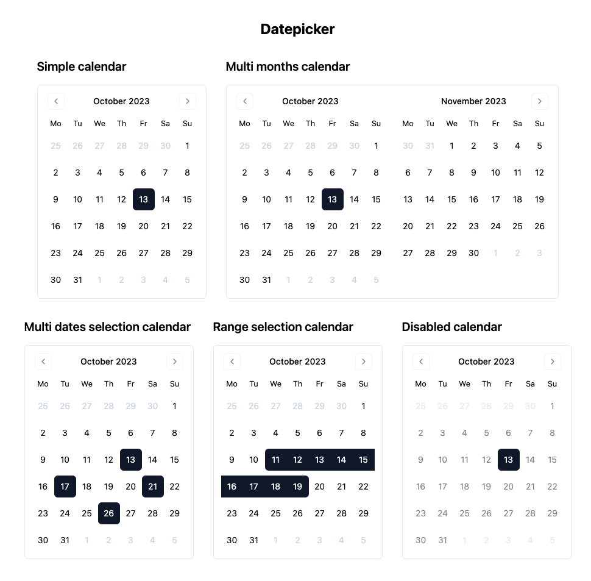

# @bryanberger/datepicker

React composable date picker inspired by react-day-picker.



## Usage

**Install the package.**

```bash
npm install @bryanberger/datepicker
```

**Compose your calendar.**

```ts
import { Calendar } from '@bryanberger/datepicker';
import { ChevronLeft, ChevronRight } from 'lucide-react';

const MyDatePicker = () => {

	return (
		<Calendar
			className="border p-3"
			mode="single"
			weekStartDay="monday"
			showOutsideDates
		>
			<Calendar.Header>
				<Calendar.Title />
				<div className="space-x-1 flex items-center">
					<Calendar.NavButton direction="previous">
						<ChevronLeft />
					</Calendar.NavButton>
					<Calendar.NavButton direction="next" >
						<ChevronRight />
					</Calendar.NavButton>
				</div>
			</Calendar.Header>
			<Calendar.Content>
				<Calendar.Head />
				<Calendar.Grid
					classNames={ { day: 'h-9 w-9 text-center data-[is-selected=true]:bg-slate-900 data-[is-first=true]:rounded-l-md data-[is-last=true]:rounded-r-md' } }
				/>
			</Calendar.Content>
		</Calendar>
	);
};

export default MyDatePicker;
```

## Documentation

Not available yet.

## License

Under [MIT license](https://github.com/BryanBerger98/datepicker/blob/main/LICENSE.txt).
